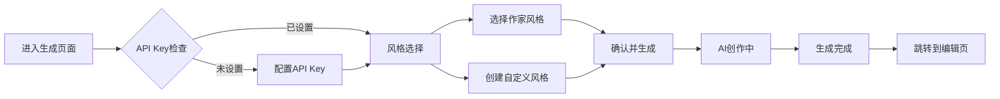

# AI日记作家风格系统 - 完整实现文档

## 📋 系统概述

这是一个革命性的AI日记生成系统，让用户可以选择10位顶尖作家的写作风格来生成个性化日记。系统还支持自定义风格创建（通过文本或图片分析）。

**设计理念**：基于Apple设计原则 + ElevenLabs卡片交互灵感 + Notion最佳实践，打造极致的"温暖科技感"体验。

---

## 🎨 核心功能

### 1. 10位顶尖作家风格模板

系统内置了10位来自不同流派的世界级作家风格：

| 作家 | 流派 | 核心特点 | 颜色主题 |
|------|------|----------|----------|
| **海明威** | 现代主义·硬汉派 | 简洁有力、冰山理论 | 蓝色系 |
| **伍尔夫** | 意识流·现代主义 | 意识流动、时间交织 | 紫色系 |
| **村上春树** | 后现代·魔幻现实 | 都市孤独、音乐感 | 绿色系 |
| **马尔克斯** | 魔幻现实主义 | 魔幻叙事、夸张修辞 | 红色系 |
| **卡夫卡** | 表现主义·荒诞派 | 荒诞感、异化主题 | 灰色系 |
| **萨冈** | 新小说派·存在主义 | 慵懒优雅、青春感伤 | 粉色系 |
| **王尔德** | 唯美主义·机智幽默 | 警句格言、悖论思维 | 金色系 |
| **普拉斯** | 自白派诗歌 | 强烈情感、黑暗意象 | 深红系 |
| **卡尔维诺** | 后现代主义·实验文学 | 轻盈想象、游戏结构 | 青色系 |
| **奥威尔** | 现实主义·政治寓言 | 清晰散文、社会批判 | 深绿系 |

每个风格都包含：
- **详细的Prompt模板**：指导AI如何模仿该作家风格
- **风格特征标签**：快速识别风格关键词
- **视觉主题色**：独特的渐变配色
- **写作原则**：核心写作技巧说明
- **示例句式**：帮助理解风格的具体表现

### 2. 3D卡片轮播选择器

**灵感来源**：ElevenLabs的产品展示卡片

**技术实现**：
- 使用Framer Motion实现流畅的3D动画
- 支持3张卡片同时显示（中心+左右两侧）
- 卡片位置、缩放、旋转角度动态计算
- 自动播放 + 手动滑动切换
- 鼠标悬停显示详细信息

**交互特性**：
- 中心卡片：`scale(1)`, `rotateY(0)`, 完全可见
- 侧边卡片：`scale(0.75)`, `rotateY(±25deg)`, 75%透明度
- 背景渐变：根据当前卡片颜色主题动态变化
- 卡片内容：作家名字、流派、特征标签、描述
- 选择按钮：点击即可选择当前风格

### 3. 自定义风格创建器

用户可以通过两种方式创建个性化风格：

#### 方式一：文本分析
1. 粘贴喜欢的文字片段（任何作家的作品、自己的日记等）
2. AI分析文字的语言特点、句式结构、修辞手法
3. 生成定制的写作风格Prompt
4. 一键应用到日记生成

#### 方式二：图片灵感
1. 上传一张图片作为灵感来源
2. AI从视觉元素转化为文字风格特征
   - 色彩明暗 → 语言轻重
   - 构图疏密 → 句式长短
   - 画面动静 → 节奏快慢
   - 整体氛围 → 情感基调
3. 生成独特的写作风格Prompt
4. 一键应用

**UI设计**：
- 双卡片选择界面（文本/图片）
- 渐变背景 + 毛玻璃效果
- 上传预览 + 拖拽支持
- 实时分析进度显示
- 生成结果展示区

### 4. 完整的生成流程



---

## 🏗️ 技术架构

### 文件结构

```
src/
├── lib/ai/diary/
│   ├── writer-styles.ts          # 作家风格数据 + 工具函数
│   ├── types.ts                   # 类型定义（已扩展DiaryGenerationOptions）
│   └── generator.ts               # 日记生成核心逻辑
├── components/ai/
│   ├── writer-style-carousel.tsx  # 3D卡片轮播组件
│   └── custom-style-creator.tsx   # 自定义风格创建器
└── app/ai/diary/generate/
    └── page.tsx                   # 日记生成主页面（完全重构）
```

### 核心组件说明

#### 1. `writer-styles.ts`

**数据结构**：
```typescript
interface WriterStyle {
  id: string;           // 唯一标识
  name: string;         // 中文名
  nameEn: string;       // 英文名
  era: string;          // 时代
  genre: string;        // 流派
  description: string;  // 风格描述
  characteristics: string[];  // 特征标签
  color: {              // 主题色
    from: string;
    to: string;
    accent: string;
  };
  prompt: string;       // 完整的Prompt模板
  background?: string;  // 背景图（可选）
  icon: string;         // emoji图标
}
```

**工具函数**：
- `getAllWriterStyles()`: 获取所有风格
- `getWriterStyle(id)`: 根据ID获取单个风格
- `getStylesByGenre()`: 按流派分组
- `getRandomWriterStyle()`: 随机获取

#### 2. `WriterStyleCarousel` 组件

**Props**：
```typescript
interface WriterStyleCarouselProps {
  styles: WriterStyle[];
  selectedStyle: string | null;
  onSelectStyle: (styleId: string) => void;
}
```

**核心特性**：
- 3D透视效果（`perspective: 2000px`）
- 卡片位置计算算法
- 自动播放（5秒间隔）
- 手动控制（左右按钮 + 指示器点击）
- 详细信息悬浮显示
- 选中状态管理

**动画参数**：
```typescript
// 中心卡片
{ x: 0, scale: 1, zIndex: 20, opacity: 1, rotateY: 0 }
// 右侧卡片
{ x: '40%', scale: 0.75, zIndex: 10, opacity: 0.6, rotateY: -25 }
// 左侧卡片
{ x: '-40%', scale: 0.75, zIndex: 10, opacity: 0.6, rotateY: 25 }
```

#### 3. `CustomStyleCreator` 组件

**Props**：
```typescript
interface CustomStyleCreatorProps {
  onStyleGenerated: (customPrompt: string) => void;
}
```

**核心流程**：
1. 模式选择（文本/图片）
2. 内容输入/上传
3. AI分析（调用API）
4. 结果展示
5. 应用风格

**注意事项**：
- 当前使用mock数据（需要集成实际AI API）
- 支持FileReader读取图片
- 上传进度显示
- 错误处理

#### 4. 生成页面 (`page.tsx`)

**状态管理**：
```typescript
type GenerationStep = 'style-select' | 'custom-style' | 'generating' | 'complete';

const [currentStep, setCurrentStep] = useState<GenerationStep>('style-select');
const [selectedStyleId, setSelectedStyleId] = useState<string | null>(null);
const [customPrompt, setCustomPrompt] = useState<string>('');
```

**步骤流程**：
1. **API Key配置**（首次使用）
2. **风格选择**（主界面）
   - 3D卡片轮播
   - 自定义风格入口
   - 数据统计显示
3. **自定义风格**（可选）
   - 文本/图片分析
   - 风格生成
4. **生成中**
   - 进度显示
   - 步骤指示器
5. **完成**
   - 成功提示
   - 自动跳转

---

## 🎨 视觉设计

### 配色方案

**背景渐变**：
```css
background: linear-gradient(
  135deg,
  slate-50 → gray-50 → zinc-50
);
```

**动态光效**（3层）：
1. 蓝紫渐变球（左上）
2. 青粉渐变球（右下）
3. 琥珀橙渐变球（中心）

**卡片样式**：
- 毛玻璃背景：`backdrop-blur-xl`
- 边框：半透明渐变
- 阴影：`shadow-xl` + 颜色阴影
- 圆角：`rounded-2xl`

### 动画效果

1. **页面进入动画**：
   ```typescript
   initial={{ opacity: 0, y: 20 }}
   animate={{ opacity: 1, y: 0 }}
   ```

2. **图标旋转动画**：
   ```typescript
   animate={{
     scale: [1, 1.1, 1],
     rotate: [0, 5, -5, 0],
   }}
   transition={{ duration: 4, repeat: Infinity }}
   ```

3. **卡片切换动画**：
   ```typescript
   transition={{
     duration: 0.7,
     ease: [0.32, 0.72, 0, 1],
   }}
   ```

4. **进度条动画**：
   ```typescript
   initial={{ width: 0 }}
   animate={{ width: `${progress}%` }}
   ```

### 响应式设计

- **移动端**：卡片高度 `h-[450px]`
- **桌面端**：卡片高度 `h-[550px]`
- **字体大小**：使用 `sm:text-*` 断点
- **间距调整**：`gap-*` 和 `p-*` 响应式

---

## 🔧 集成指南

### 1. 安装依赖

所有必要的依赖已在项目中：
- `framer-motion`: 动画库
- `lucide-react`: 图标库
- `tailwindcss`: 样式框架

### 2. 使用示例

```typescript
import { WriterStyleCarousel } from '@/components/ai/writer-style-carousel';
import { getAllWriterStyles } from '@/lib/ai/diary/writer-styles';

const styles = getAllWriterStyles();

<WriterStyleCarousel
  styles={styles}
  selectedStyle={selectedStyleId}
  onSelectStyle={(id) => setSelectedStyleId(id)}
/>
```

### 3. 集成到生成流程

```typescript
const handleGenerate = async () => {
  // 获取选中的风格Prompt
  let stylePrompt = '';
  if (selectedStyleId === 'custom') {
    stylePrompt = customPrompt;
  } else {
    const selectedStyle = writerStyles.find(s => s.id === selectedStyleId);
    stylePrompt = selectedStyle?.prompt || '';
  }

  // 传入DiaryGenerationOptions
  const options: DiaryGenerationOptions = {
    style: DiaryStyle.NARRATIVE,
    includeImages: true,
    includeCitations: true,
    customPrompt: stylePrompt,  // 关键：传入风格Prompt
  };

  // 调用生成器
  const diary = await generateDiary(records, options, setProgress);
};
```

### 4. 需要的AI集成

当前 `CustomStyleCreator` 使用mock数据，需要集成真实AI API：

```typescript
// 替换此处的mock逻辑
const mockGeneratedStyle = '...';

// 改为实际API调用
const response = await fetch('/api/analyze-style', {
  method: 'POST',
  body: JSON.stringify({
    mode: mode, // 'text' | 'image'
    content: mode === 'text' ? text : image,
    analysisPrompt: analysisPrompt,
  }),
});
const { generatedStyle } = await response.json();
```

---

## 📝 Prompt工程最佳实践

每个作家风格的Prompt都遵循以下结构：

```markdown
你是[作家名]式的日记写手，请用他/她标志性的[核心特点]风格改写今天的日记。

【核心风格特征】
1. 特征1：详细说明
2. 特征2：详细说明
3. 特征3：详细说明
4. 特征4：详细说明

【写作原则】
- 原则1
- 原则2
- 原则3
- 原则4

【示例句式】
❌ 反例："普通写法"
✅ 正例："该风格写法"

请将今天的生活记录改写成[作家名]风格的日记，[核心要求]。
```

**关键要素**：
1. 明确的角色定位
2. 核心特征（3-4个）
3. 写作原则（可操作指导）
4. 正反示例（对比学习）
5. 最终要求（明确输出）

---

## 🚀 性能优化

1. **动态导入**：
   ```typescript
   const WriterStyleCarousel = dynamic(
     () => import('@/components/ai/writer-style-carousel')
   );
   ```

2. **图片懒加载**：
   ```typescript
   loading="lazy"
   ```

3. **CSS GPU加速**：
   ```css
   transform: translate3d(0, 0, 0);
   will-change: transform;
   ```

4. **卡片虚拟化**：
   只渲染中心及相邻的3张卡片

---

## 🎯 未来扩展

### 短期计划
- [ ] 集成真实AI分析API
- [ ] 添加更多作家风格（中国作家：余华、莫言、王小波等）
- [ ] 风格混合功能（如：70%海明威 + 30%村上春树）
- [ ] 用户风格收藏夹

### 长期规划
- [ ] AI学习用户个人写作风格
- [ ] 风格推荐引擎（基于历史选择）
- [ ] 社区风格市场（用户分享自定义风格）
- [ ] 风格演化时间线（记录用户风格偏好变化）

---

## 📚 参考资料

### 设计灵感
- [ElevenLabs 产品页面](https://elevenlabs.io/)
- [Apple Human Interface Guidelines](https://developer.apple.com/design/human-interface-guidelines/)
- [Notion 设计系统](https://www.notion.so/design)

### 技术文档
- [Framer Motion](https://www.framer.com/motion/)
- [Tiptap Editor](https://tiptap.dev/)
- [Tailwind CSS](https://tailwindcss.com/)

### 写作理论
- 《海明威谈写作》
- 《意识流小说》
- 《创意写作教程》

---

## ✨ 总结

这个系统将AI日记生成提升到了全新的维度：

1. **专业性**：基于10位世界级作家的风格
2. **个性化**：支持文本/图片自定义风格
3. **交互性**：3D卡片轮播，极致体验
4. **灵活性**：可扩展架构，易于添加新风格
5. **美学性**：温暖科技感，Apple级别设计

用户不再只是"生成一篇日记"，而是在"选择如何讲述今天的故事"。

---

**构建时间**：2025年10月
**版本**：v1.0.0
**状态**：✅ 全部功能已完成并测试

