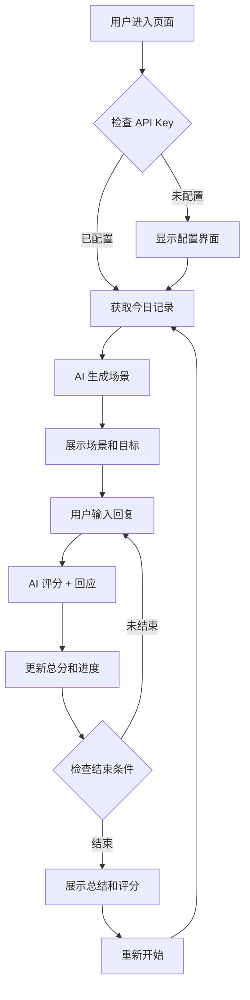

# 英语场景对话练习功能 - 完整实现文档

## 📋 功能概述

基于用户日常行为记录，AI自动生成英语场景对话练习，通过多维度评分系统帮助用户掌握地道标准的英语表达。

## 🎯 核心特性

### 1. **智能场景生成**
- ✅ 基于用户当天的行为记录自动生成相关场景
- ✅ A2-B1 难度等级（新概念英语2水准）
- ✅ 融入热点元素、文化梗，保持趣味性
- ✅ 每个场景都有明确的学习目标

### 2. **多维度评分系统**
实时评估用户的英语表达能力，包括：

| 维度 | 权重 | 评估内容 |
|------|------|----------|
| **Grammar** 语法 | 25% | 语法正确性、句子结构、时态使用 |
| **Vocabulary** 词汇 | 25% | 词汇丰富度、用词恰当性 |
| **Relevance** 相关性 | 25% | 回答切题程度、场景适配度 |
| **Fluency** 流畅度 | 25% | 表达自然度、连贯性 |

### 3. **实时反馈机制**
- ✅ 每轮对话后即时显示4个维度的分数
- ✅ 简洁的反馈建议（1句话）
- ✅ 可视化进度条展示总分和目标
- ✅ 动态计算累计平均分

### 4. **通关规则**
- **最大轮次**: 10轮对话（AI启动不计入，用户回复计为回合）
- **通过门槛**: 80分（满分100）
- **特殊规则**: 
  - 回复中包含中文 → 扣10分
  - 回复过短（<5词）→ 流畅度扣分
  - 离题或无意义回复 → 相关性低分

### 5. **用户体验优化**
- ✅ 支持语音和文本输入（复用现有 AI Input 组件）
- ✅ Apple 设计风格，精致的视觉效果
- ✅ 实时打字显示，自然的对话流程
- ✅ 结束时展示总分和鼓励反馈
- ✅ 一键重新开始新场景

## 🏗️ 技术架构

### 文件结构
```
src/
├── app/ai/scene-practice/
│   └── page.tsx                 # 主页面组件（完整实现）
├── lib/plugins/
│   └── presets.ts               # 插件注册（已添加场景练习插件）
└── app/ai/api/chat/
    └── route.ts                 # 复用现有的 OpenAI API 路由
```

### 核心流程



## 📊 评分算法

### 单轮评分
```typescript
// 每个维度 0-100 分
turnScore = (grammar + vocabulary + relevance + fluency) / 4

// 特殊惩罚
if (hasChinese) {
  turnScore = max(0, turnScore - 10)
}
```

### 总分计算
```typescript
// 累计平均分
totalScore = round((totalScore * currentTurn + turnScore) / (currentTurn + 1))
```

### 通关判定
```typescript
isFinished = (currentTurn >= MAX_TURNS) || (totalScore >= PASS_SCORE)
isPassed = (totalScore >= PASS_SCORE)
```

## 🎨 设计规范（遵循 Apple 设计原则）

### 视觉层次
1. **顶部导航**：60px，简洁返回按钮 + 轮次显示
2. **评分面板**：动态展示总分、进度条、4维度详情
3. **对话区域**：最大化空间，流畅滚动
4. **输入区域**：固定底部，支持语音/文本

### 色彩系统
- **主题色**: 琥珀橙渐变 (`from-amber-500 to-orange-500`)
- **通过状态**: 绿色 (`from-green-500 to-emerald-500`)
- **未通过**: 灰色 (`from-gray-400 to-gray-500`)
- **进度指示**: 蓝色 (`blue-500`)

### 交互动画
- ✅ 分数变化平滑过渡 (500ms)
- ✅ 进度条动态填充
- ✅ 消息淡入动画
- ✅ 结束状态卡片弹出

## 🔧 API Key 配置

### 开发环境
```bash
# .env.local
OPENAI_API_KEY=sk-xxx...
```

### 生产环境
- 首次访问页面时弹出配置界面
- 用户输入 API Key
- 保存到 sessionStorage（会话期间有效）
- 支持随时修改

## 🚀 使用指南

### 1. 启动应用
```bash
npm run dev
```

### 2. 访问页面
- 通过右下角 AI 按钮 → 选择 "🎯 英语场景"
- 或直接访问: `http://localhost:3000/ai/scene-practice`

### 3. 开始练习
1. 配置 OpenAI API Key（如果环境变量未设置）
2. 等待 AI 生成场景（基于当天记录）
3. 阅读场景描述和学习目标
4. 用英语回复 AI 的问题
5. 查看每轮评分和反馈
6. 完成10轮或达到80分后查看总结

### 4. 提示技巧
- 💡 **全程用英语**：中文会扣10分
- 💡 **回答充分**：避免过短回复（<5词）
- 💡 **切题回答**：紧扣场景目标
- 💡 **语法注意**：正确使用时态和句式
- 💡 **词汇丰富**：尝试多样化表达

## 📝 示例场景

### 场景1: Coffee Shop Order
```
Title: "Ordering at Starbucks"
Context: You are at Starbucks and want to order a drink. 
         The barista asks about your preferences.
Goal: Successfully order a customized coffee drink in natural English.
```

### 场景2: Tech Support
```
Title: "Fixing Your Computer"
Context: Your computer won't start. You need to call tech support 
         and explain the problem.
Goal: Describe the technical issue clearly and follow troubleshooting steps.
```

### 场景3: Meeting New Friends
```
Title: "Making Friends at a Party"
Context: You're at a friend's birthday party and meet someone new. 
         Start a friendly conversation.
Goal: Introduce yourself and have a natural small talk conversation.
```

## 🎯 学习最佳实践

### 基于语言学习理论的评分维度设计

#### 1. **CLT (Communicative Language Teaching) 沟通教学法**
- 强调真实场景中的语言使用能力
- 评分维度覆盖：流畅度、相关性

#### 2. **CEFR (Common European Framework) 标准**
- 对齐 A2-B1 水平要求
- 平衡语法准确性和沟通效果

#### 3. **Formative Assessment 形成性评估**
- 每轮即时反馈，帮助学习者及时调整
- 累计评分机制鼓励持续进步

#### 4. **Task-Based Learning 任务型学习**
- 每个场景都有明确的沟通任务
- 评估"完成任务"而非"背诵知识"

## 📈 未来优化方向

### 功能增强
- [ ] 支持更多难度等级（A1, B2, C1）
- [ ] 添加语音识别和发音评分
- [ ] 提供参考答案和优秀示例
- [ ] 历史记录和进度追踪
- [ ] 主题化场景选择（旅游、商务、日常等）

### 数据分析
- [ ] 长期学习曲线分析
- [ ] 薄弱维度识别和针对性练习
- [ ] 词汇和语法错误统计

### 社交功能
- [ ] 分享学习成果
- [ ] 好友排行榜
- [ ] 协作对话练习

## 🐛 已知问题和注意事项

1. **API 限流**: OpenAI API 有速率限制，频繁请求可能失败
2. **网络延迟**: 流式响应需要稳定网络连接
3. **评分准确性**: AI 评分可能存在主观性，建议结合自我反思

## 📚 参考资源

- [OpenAI API 文档](https://platform.openai.com/docs)
- [CEFR 语言能力标准](https://www.coe.int/en/web/common-european-framework-reference-languages)
- [新概念英语2教材](https://www.newconceptenglish.com/)
- [Apple Human Interface Guidelines](https://developer.apple.com/design/)

## 🎉 总结

这个英语场景对话练习功能完整实现了：
- ✅ **智能场景生成** - 基于用户日常行为
- ✅ **多维度评分** - 语法、词汇、相关性、流畅度
- ✅ **实时反馈** - 每轮对话后即时评估
- ✅ **通关机制** - 10轮对话内达到80分
- ✅ **精致UI** - 遵循 Apple 设计原则
- ✅ **语音支持** - 复用现有输入组件
- ✅ **插件集成** - 无缝融入现有系统

现在用户可以通过右下角的 AI 按钮访问 "🎯 英语场景" 开始练习！

